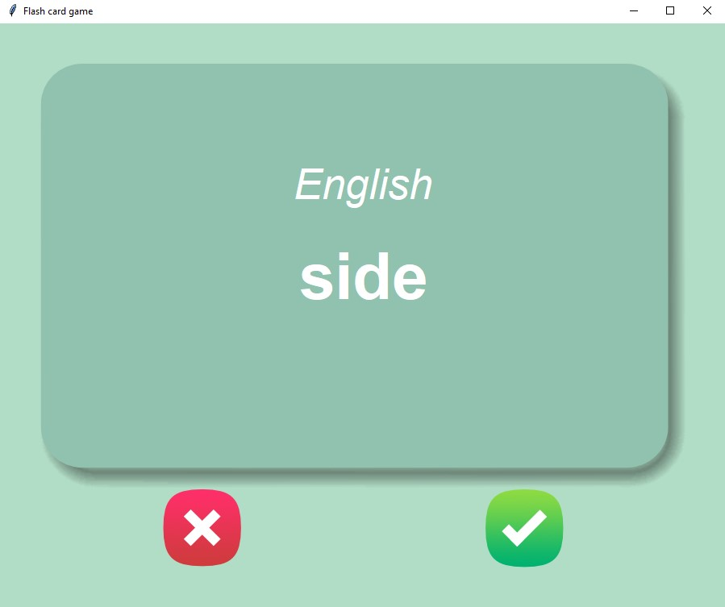

# Flashcard Game

This is a simple flashcard game implemented in Python using the Tkinter library. The game displays French words on flashcards and allows users to test their knowledge of the corresponding English translations.



## Features

- Display random French words on flashcards.
- Flip the flashcards to reveal their English translations.
- Mark flashcards as "known" or "unknown" based on user input.
- Save progress and remove known flashcards from future rounds.
- Data is stored in CSV format for easy management.

## Requirements

- Python 3.x
- Tkinter library
- Pandas library

## Installation and Usage

1. Clone or download this repository.

2. Navigate to the project directory.

3. Install the required libraries using pip:

   ```shell
   pip install pandas
4. Run the flashcard game script: python flashcard_game.py
5. The game window will open, and you can start playing by clicking the "wrong" or "right" buttons to indicate your knowledge of the flashcards.
6. The game will save your progress, and known flashcards will be removed from future rounds. Progress is stored in the words_to_learn.csv file.

## Customize Flashcard Data   

By default, the game uses flashcard data stored in the french_words.csv file. However, you can customize the flashcards by modifying this file or replacing it with your own CSV file.
The CSV file should have two columns: "French" for the French words and "English" for their English translations. Each row represents a flashcard.
Ensure that the CSV file is formatted correctly and located in the data directory.

## Acknowledgements
The flashcard data used in this game is based on the french_words.csv file provided with the project.
